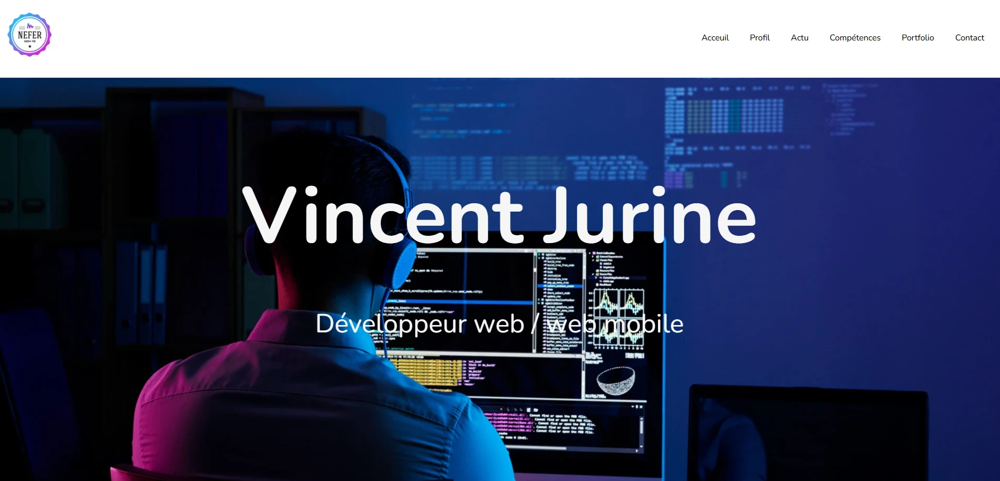

# 🎨 Mon Portfolio - NeferNedjer

Bienvenue sur mon portfolio ! Ce projet présente une vitrine de mes compétences, projets et passions en tant que développeur web en formation. Il a été conçu avec amour, HTML, CSS, un peu de JavaScript… et beaucoup de café ☕.

## 🚀 Aperçu

👉 [Voir le site en ligne](https://nefernedjer.github.io/portfolio/) *(remplace ce lien avec GitHub Pages ou Netlify)*

 *(ajoute une capture ici !)*

---

## 🛠️ Technologies utilisées

- HTML5
- CSS3
- JavaScript (vanilla)
- Un soupçon de design responsive

---

## 📂 Structure du projet

portfolio/ 

├── css/ │ └── style.css 

├── js/ │ └── script.js 

├── img/ │ └── (images de ton site) 

├── index.html 

└── README.md

---

## 💡 Fonctionnalités

- Présentation de mon profil
- Liste de projets
- Mise en page responsive
- Navigation fluide
- 💬 (bientôt) formulaire de contact fonctionnel

---

## 📈 Ce que je prévois d'ajouter

- Intégration d'une API (par exemple TMDB)
- Thème sombre 🌙 / clair ☀️
- Optimisation mobile
- Animations CSS ou avec JavaScript

---

## 📬 Me contacter

Tu veux bosser avec moi ? Me faire un retour ? Ou juste m’envoyer des emojis ?  
➡️ [Mon LinkedIn](https://www.linkedin.com/in/vincent-jurine-990ba4303/)  
📧 contact : vincejurine@gmail.com

---

## ⚖️ Licence

Ce projet est sous licence **Creative Commons BY-NC-SA 4.0**  
> Tu peux le réutiliser, le modifier, le partager, **mais pas à des fins commerciales**, et tu dois **me créditer**.

---

> "Fais toujours en sorte que ton code parle de toi, même quand t’es pas dans la pièce."

